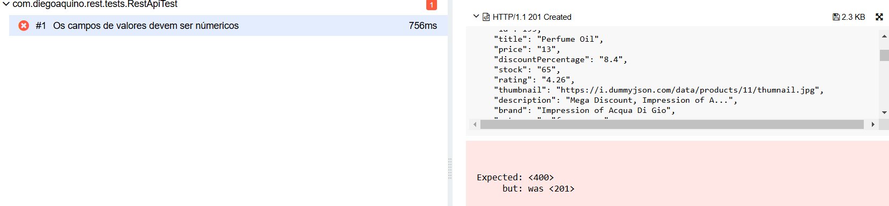
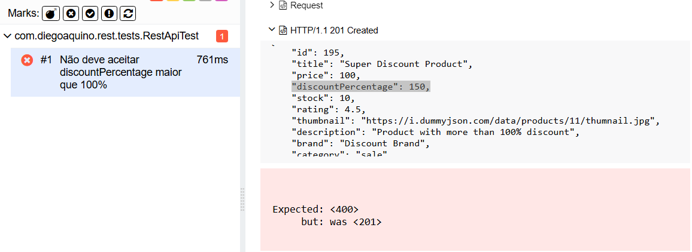

# Desafio QA Sicredi
Framework de automação de testes de API usando REST Assured com Java + Maven + Junit.

O projeto segue muitas das melhores práticas da indústria.

Tecnologias/Ferramentas usadas na construção do framework
=================================================
- Rest Assured
- Junit
- Java
- Allure Reports
- Hamcrest
- IntelliJ
- GitHub

O framework implementa as seguintes melhores práticas 
=========================================
- Escalável e extensíve
- Especificações reutilizáveis do Rest Assured
- Requisições de API reutilizáveis do Rest Assured
- Separação da camada de API da camada de teste
- Relatórios e logs robustos usando Allure
- Automatização de cenários positivos e negativos
- Testes automatizados utilizando JUnit
- Renovação automática do token de acesso
- Integração com GitLab
- Criação de pipeline com GitLab CI para geração automática de relatórios

---


## Estrutura do Projeto

```plaintext
├── src
│   ├── main
│   │   └── java
│   └── test
│       └── java
│           └── com
│               └── diegoaquino
│                   ├── rest
│                   │   ├── api
│                   │   │   ├── aplicacaoApi
│                   │   │   │   └── ProdutoApi.java
│                   │   │   ├── BaseTest.java
│                   │   │   ├── Constantes.java
│                   │   │   └── RecursosRest.java
│                   │   ├── models
│                   │   │   └── Produto.java
│                   │   ├── tests
│                   │   │   └── RestApiTest.java
│                   │   ├── utils
│                   │   │   └── Utils.java
│
├── .gitlab-ci.yml
├── pom.xml
└── README.md 
```

---

## Como Executar

Siga os passos abaixo para configurar e executar os testes automatizados deste projeto.

### Pré-requisitos

Certifique-se de que você tem as seguintes ferramentas instaladas em seu ambiente de desenvolvimento:

- **Java 17**
- **Maven**
- **Git**
- **Allure Report**

### Passos para Executar

1. **Clone o repositório**:

   Clone o repositório do projeto para o seu ambiente local usando o comando abaixo:
   ```sh
   git clone https://gitlab.com/diegoaquino91/desafio-qa-sicredi.git
   ```
2. **Instale as dependências do Maven**:
   ```sh
    mvn clean install
   ```
3. **Execute os testes**:
   ```sh
    mvn test
   ```
4. **Gerar relatórios do Allure**:
   ```sh
    allure serve allure-results
   ```
---

### Como Visualizar o Relatório Allure no GitLab

Após a execução do pipeline no GitLab CI/CD, o relatório Allure será publicado como uma página estática. Para acessar o relatório gerado, siga as etapas abaixo:

1. **Acesse o Repositório no GitLab**
    - Navegue até o repositório do seu projeto no GitLab.

2. **Localize a Seção de "Páginas"**
    - No menu lateral esquerdo, clique em **"Implantação"** e, em seguida, selecione **"Páginas"**.

3. **Acesse o Link do Relatório**
    - Na seção **"Páginas"**, será exibido um link semelhante ao exemplo abaixo:


4. **Clique no Link Gerado**
    - Clique sobre o link para acessar o relatório Allure diretamente no seu navegador.

5. **Visualize o Relatório**
    - O relatório Allure exibirá informações detalhadas sobre a execução dos testes, incluindo cenários, gráficos e métricas de desempenho.


### Observações Importantes:
- O relatório será disponibilizado exclusivamente na branch **principal** (`main`), conforme a configuração definida no arquivo `.gitlab-ci.yml`.
- Certifique-se de que o pipeline foi executado com sucesso.

---

## Plano de Testes

Este plano de testes descreve os cenários de teste automatizados para a API de Gerenciamento de Produtos Eletrônicos. A automação é feita utilizando Java, RestAssured, JUnit e Allure para relatórios.

### Estratégia de Teste

Foram realizados Os testes automatizados que abrangem as seguintes funcionalidades da API:
- Consulta de status da API
- Validação de usuários para autenticação
- Criação de tokens de autenticação
- Consulta de produtos
- Criação de produtos
- Manuseio de erros (ex: credenciais inválidas, produtos não encontrados)

### Casos de Teste

1. **Consulta de Status**
    - **Objetivo**: Verificar se o endpoint de status da API está funcionando corretamente.
    - **Entrada**: Nenhuma
    - **Validações**:
        - Código de status HTTP 200
        - Campo `status` igual a "ok"
        - Campo `method` igual a "GET"


2. **Validação de Usuário**
    - **Objetivo**: Validar se o endpoint de usuários retorna as credenciais corretas para autenticação.
    - **Entrada**: Nenhuma
    - **Validações**:
        - Código de status HTTP 200
        - Campo `username` do primeiro usuário igual a "emilys"
        - Campo `password` do primeiro usuário igual a "emilyspass"


3. **Criação de Token de Autenticação**
    - **Objetivo**: Verificar se o endpoint de login autentica corretamente e retorna um token de acesso.
    - **Entrada**: Credenciais de usuário
    - **Validações**:
        - Código de status HTTP 200
        - Campo `accessToken` não nulo
        - Campo `username` igual a "emilys"
        - Campo `email` igual a "emily.johnson@x.dummyjson.com"


4. **Token com Username Inválido**
    - **Objetivo**: Verificar a resposta da API quando o username é inválido.
    - **Entrada**: Credenciais de usuário com username inválido
    - **Validações**:
        - Código de status HTTP 400
        - Campo `message` igual a "Invalid credentials"


5. **Token com Password Inválido**
    - **Objetivo**: Verificar a resposta da API quando o password é inválido.
    - **Entrada**: Credenciais de usuário com password inválido
    - **Validações**:
        - Código de status HTTP 400
        - Campo `message` igual a "Invalid credentials"


6. **Token sem Username**
    - **Objetivo**: Verificar a resposta da API quando o username não é fornecido.
    - **Entrada**: Credenciais de usuário sem username
    - **Validações**:
        - Código de status HTTP 400
        - Campo `message` igual a "Username and password required"


7. **Token sem Password**
    - **Objetivo**: Verificar a resposta da API quando o password não é fornecido.
    - **Entrada**: Credenciais de usuário sem password
    - **Validações**:
        - Código de status HTTP 400
        - Campo `message` igual a "Username and password required"


8. **Consulta de Produtos Autenticado**
    - **Objetivo**: Verificar se é possível consultar produtos estando autenticado.
    - **Entrada**: Token de acesso
    - **Validações**:
        - Código de status HTTP 200
        - Vários campos específicos do produto, como `id`, `title`, `price`, `category`, `rating`, `availabilityStatus`


9. **Consulta de Produtos com Token Inválido**
    - **Objetivo**: Verificar a resposta da API quando o token é inválido.
    - **Entrada**: Token de acesso inválido
    - **Validações**:
        - Código de status HTTP 401
        - Campo `message` igual a "Invalid/Expired Token!"


10. **Criação de Produto**
    - **Objetivo**: Verificar se é possível criar um novo produto.
    - **Entrada**: Dados do novo produto
    - **Validações**:
        - Código de status HTTP 201
        - Vários campos específicos do produto, como `title`, `description`, `price`, `discountPercentage`, `rating`, `stock`, `brand`, `category`, `thumbnail`


11. **Consulta de Lista de Produtos**
    - **Objetivo**: Verificar se é possível consultar a lista de produtos.
    - **Entrada**: Nenhuma
    - **Validações**:
        - Código de status HTTP 200
        - Vários campos específicos dos produtos na lista, como `id`, `title`, `price`, `category`, `rating`, `availabilityStatus`


12. **Consulta de Produtos por ID**
    - **Objetivo**: Verificar se é possível consultar um produto específico pelo ID.
    - **Entrada**: ID do produto
    - **Validações**:
        - Código de status HTTP 200
        - Vários campos específicos do produto, como `id`, `title`, `price`, `category`, `rating`, `availabilityStatus`


13. **Consulta de Produtos por ID Inválido**
    - **Objetivo**: Verificar a resposta da API quando um produto não cadastrado é consultado.
    - **Entrada**: ID inválido do produto
    - **Validações**:
        - Código de status HTTP 404
        - Campo `message` igual a "Product with id '1005' not found"


14. **Campos de Valores Devem Ser Numéricos**
    - **Objetivo**: Verificar se a API aceita apenas valores numéricos para os campos `price`, `discountPercentage`, `rating` e `stock`.
    - **Entrada**: Dados do novo produto com valores de campos como strings
    - **Validações**:
        - Código de status HTTP 404
        - Verificação de que os campos `price`, `discountPercentage`, `rating` e `stock` são numéricos


15. **Não Deve Aceitar `discountPercentage` Maior que 100%**
    - **Objetivo**: Verificar se a API rejeita produtos com `discountPercentage` maior que 100%.
    - **Entrada**: Dados do novo produto com `discountPercentage` maior que 100%
    - **Validações**:
        - Código de status HTTP 400
        - Mensagem de erro contendo "discountPercentage deve ser menor ou igual a 100

---
## Relatório de Bugs

### Bug01: Campos Numéricos Aceitando Valores de String

- **Descrição**: A API está aceitando valores de string para campos que deveriam ser numéricos (`price`, `discountPercentage`, `rating`, `stock`).
- **Passos para Reproduzir**:
    1. Envie uma requisição para adicionar um produto com valores de string nos campos `price`, `discountPercentage`, `rating` e `stock`.
    2. Verifique a resposta da API.
- **Código do Teste**:
    ```java
    @Test
    @DisplayName("Os campos de valores devem ser numéricos")
    public void adicionarProdutoValoresNumericos() {
        Map<String, Object> produtoInvalidoMap = Utils.criarProdutoComValoresInvalidos();

        Response response = ProdutoApi.post("products/add", produtoInvalidoMap);
        JsonPath jsonPath = new JsonPath(response.body().asString());
        
        assertThat(response.statusCode(), equalTo(400));
        assertThat(jsonPath.getString("errorMessage[0]"), containsString("O campo price deve ser númerico"));
        assertThat(jsonPath.getString("errorMessage[1]"), containsString("O campo discountPercentage deve ser númerico"));
        assertThat(jsonPath.getString("errorMessage[2]"), containsString("O campo rating deve ser númerico"));
        assertThat(jsonPath.getString("errorMessage[3]"), containsString("O campo stock deve ser númerico"));
    }
    ```
- **Resultado Esperado**: A API deve retornar um erro informando que os valores dos campos devem ser numéricos.
- **Resultado Atual**: A API aceita os valores de string e os retorna na resposta.



---
### Bug02: Campo de desconto Aceitando Valores Maiores que 100%

- **Descrição**: A API está aceitando valores de `discountPercentage` maiores que 100%.
- **Passos para Reproduzir**:
    1. Envie uma requisição para adicionar um produto com `discountPercentage` maior que 100.
    2. Verifique a resposta da API.
- **Código do Teste**:
    ```java
    @Test
    @DisplayName("Não deve aceitar descontos maiores que 100%")
    public void naoDeveAceitarDiscountMaiorQue100() {
        Produto produtoInvalido = Utils.criarProdutoComDiscountInvalido();

        Response response = ProdutoApi.post("products/add", produtoInvalido);
        JsonPath jsonPath = new JsonPath(response.body().asString());

        assertThat(response.statusCode(), equalTo(400));
        assertThat(jsonPath.getString("errorMessage"), containsString("discountPercentage deve ser menor ou igual a 100"));
    }
    ```
- **Resultado Esperado**: A API deve retornar um erro informando que `discountPercentage` deve ser menor ou igual a 100.
- **Resultado Atual**: A API aceita valores de `discountPercentage` maiores que 100%.



